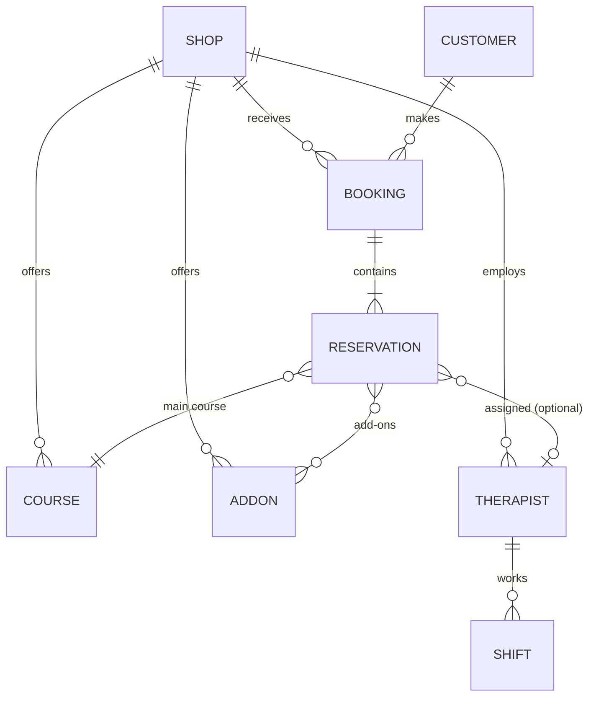

# Draft — Phân tích nghiệp vụ: Hệ thống đặt lịch massage りらくる

> Bản tổng hợp từ tài liệu mô tả nghiệp vụ (business.md). Các điểm chưa rõ được đánh dấu ❓ ở cuối tài liệu.

> **Scope (chốt với mentor 09/07):** Team tự build **toàn bộ hệ thống booking = BE (cung cấp API) + FE**. Không có POS bên ngoài — "POS" trong tài liệu gốc chính là hệ thống mình đang làm. AI chatbot là **client tương lai** của bộ API này, ngoài scope giai đoạn 1.

---

## 1. Business Entities

| Entity | Mô tả |
|---|---|
| **Shop** | Cửa hàng trong chuỗi. Hoạt động độc lập: dịch vụ, lịch, đội therapist riêng. |
| **Course** | Dịch vụ chính (もみほぐし, ドライヘッドスパ...). Thuộc về một Shop. |
| **AddOn** | Dịch vụ bổ sung (足つぼ, プレミアムマットレス...). Chỉ đi kèm Course chính. |
| **Therapist** | Nhân viên trị liệu, thuộc một Shop, làm việc theo ca. |
| **Shift** | Ca làm việc của Therapist (ngày + khung giờ). |
| **Customer** | Khách hàng, nhận dạng qua số điện thoại. |
| **Booking** | Lượt đặt chỗ tổng (1 cuộc gọi đặt). Booking nhóm gồm nhiều Reservation. |
| **Reservation** | Suất phục vụ cho từng người trong Booking (mỗi người 1 slot riêng, cùng giờ). |
| **TimeSlot** | Khung giờ bắt đầu khả dụng tại một Shop, một ngày. |
| **NGList** | Danh sách số điện thoại bị cấm đặt chỗ. |
| **ComboRestriction** | Tổ hợp course + add-on không được phép (do hệ thống mình định nghĩa — trước đây gán cho "POS"). |
| **Account** | Tài khoản đăng nhập nội bộ (admin / therapist). Admin quản lý các cửa hàng và cấp tài khoản cho therapist. |

---

## 2. Attributes

### Shop
- `shop_code` — mã cửa hàng (định danh riêng)
- `name`, `address`, `phone`

### Course / AddOn
- `name` — tên dịch vụ
- `duration` — thời lượng, **bội số 15 phút** (30, 45, 60, 90, 120...)
- `price` — giá tiền
- `type` — course chính / add-on
- `shop_id` — thuộc cửa hàng nào
- `available` — khả dụng theo ngày (có thể tắt khi shop nghỉ / thiếu người)

### Therapist
- `name`, `gender` (nam/nữ)
- `shop_id` — thuộc một cửa hàng
- Lịch làm việc theo ca (qua Shift)

### Shift
- `therapist_id`, `date`, giờ bắt đầu / kết thúc ca

### Customer
- `phone` — khóa nhận dạng chính (tra thành viên / NG list)
- `email` — dùng xác thực và nhận mã đặt chỗ (BR-15)
- `member_type` — thành viên / khách mới
- `rank` — hạng thành viên
- `visit_count` — số lần ghé thăm
- `is_ng` — có nằm trong NG list không

### Booking
- `shop_id`, `date`, `start_time`
- `party_size` — số người (tối đa 3 — BR-14)
- `phone` — số điện thoại khách đặt
- `booking_code` — mã đặt chỗ (BE sinh sau khi tạo thành công)
- Danh sách Reservation (nhóm ≥2: tất cả cùng course — BR-10)

### Reservation (mỗi người)
- `main_course_id` — course chính (bắt buộc)
- `addon_ids` — add-on (tùy chọn)
- `therapist_id` hoặc `therapist_gender` — chỉ định (tùy chọn, chỉ booking 1 người)

### TimeSlot
- `shop_id`, `date`, `start_time`
- Khả dụng phụ thuộc: dịch vụ chọn (thời lượng), số người, therapist chỉ định

---

## 3. Business Rules

| # | Rule |
|---|---|
| BR-01 | Add-on **không được đặt một mình**, phải kèm course chính. |
| BR-02 | Thời lượng dịch vụ là bội số của 15 phút. |
| BR-03 | Một therapist chỉ phục vụ **một khách tại một thời điểm**. |
| BR-04 | Booking nhóm (≥2 người) **không được chỉ định therapist**. |
| BR-05 | Chỉ định therapist phải kiểm tra therapist có làm ca tại slot đó không. |
| BR-06 | Số điện thoại trong NG list → **từ chối tạo booking**, đề nghị liên hệ cửa hàng. |
| BR-07 | Slot khả dụng phụ thuộc shop + ngày + dịch vụ (thời lượng) + số người + therapist. |
| BR-08 | Slot có thể hết theo thời gian thực → phải xử lý conflict sau khi khách confirm (gợi ý giờ gần nhất còn trống). |
| BR-09 | Một số tổ hợp course + add-on không được phép kết hợp (bảng combo_restriction do hệ thống định nghĩa) → yêu cầu khách chọn lại. |
| BR-10 | Booking nhóm = nhiều reservation liên kết, **cùng giờ, cùng course chính** (add-on được chọn riêng từng người), mỗi người một slot. |
| BR-11 | Dữ liệu tách biệt theo shop: dịch vụ, lịch, therapist không dùng chung giữa các cửa hàng. |
| BR-12 | Booking chỉ hợp lệ khi BE tạo thành công và sinh mã đặt chỗ; lỗi hệ thống → báo lỗi, cho khách thử lại. |
| BR-13 | Booking sau khi tạo **có thể hủy hoặc sửa** (qua FE; sau này thêm kênh AI chatbot). |
| BR-14 | Booking nhóm **tối đa 3 người**; muốn >3 người → hướng dẫn liên hệ cửa hàng trực tiếp. |
| BR-15 | Xác thực khách qua **email**; mã đặt chỗ gửi qua email. SĐT vẫn thu để tra thành viên / NG list. |
| BR-16 | **Sửa và hủy** booking chỉ được trước giờ hẹn tối thiểu **1 giờ**. |
| BR-17 | Khi tạo booking xong, BE cấp **session token hiệu lực 2 phút** cho phép sửa nhanh chính booking vừa tạo (đúng id đó). Token hết hạn → muốn sửa/hủy phải qua trang quản lý trên web (xác thực email + mã đặt chỗ) hoặc gọi cửa hàng. |
| BR-18 | Sửa booking được đổi: **ngày/giờ, dịch vụ, số người** (vẫn tối đa 3 — BR-14). Muốn đổi lên >3 người hoặc **đổi cửa hàng** → hướng dẫn liên hệ cửa hàng trực tiếp. |
| BR-19 | Sau khi phục vụ xong, booking được cập nhật trạng thái (**COMPLETED**) và hệ thống **tự động +1 visit_count** cho khách. |
| BR-20 | Rank thành viên hiện **chỉ để hiển thị**, không ảnh hưởng nghiệp vụ đặt chỗ. NG list có lưu và **hiển thị lý do cấm**. |

---

## 4. Relationship Entity

```
Shop      1 ── N  Course / AddOn
Shop      1 ── N  Therapist
Shop      1 ── N  TimeSlot
Shop      1 ── N  Booking

Therapist 1 ── N  Shift
Therapist 1 ── N  Reservation   (0..1 phía Reservation — chỉ khi chỉ định)

Customer  1 ── N  Booking       (qua số điện thoại)

Booking   1 ── N  Reservation   (booking 1 người = 1 reservation)
Reservation N ── 1  Course       (course chính, bắt buộc)
Reservation N ── N  AddOn        (0 hoặc nhiều)
Reservation N ── 1  TimeSlot
```

Sơ đồ Mermaid:



---

## 5. Lifecycle / State

### Booking

```
[Đang thu thập thông tin]
        │  khách xác nhận toàn bộ
        ▼
[Chờ tạo (BE xử lý transaction)]
        │ thành công (có booking_code)      │ slot bị chiếm (conflict)
        ▼                                   ▼
   [CONFIRMED]                     [Đề xuất giờ khác] → quay lại confirm
        │
        ├── khách sửa (FE/API) → [MODIFIED] (vẫn confirmed, thông tin mới)
        ├── khách hủy (FE/API) → [CANCELLED]
        └── đến giờ, phục vụ  → [COMPLETED] + tự động +1 visit_count (BR-19)
```

- Lỗi hệ thống khi tạo → booking **không tồn tại**, khách thử lại.
- Sửa/hủy: chỉ trước giờ hẹn ≥1 giờ (BR-16). Trong 2 phút sau khi tạo: sửa nhanh bằng session token; sau đó qua trang quản lý web (BR-17).
- Đã chốt: có cập nhật trạng thái sau phục vụ, COMPLETED tự động +1 visit_count (BR-19). (No-show có là trạng thái riêng không: ❓ giả định giữ trong enum.)

### TimeSlot

```
[Available] → (có người đặt) → [Booked]
```
Slot thay đổi thời gian thực; giữa lúc khách chọn và lúc confirm có thể chuyển sang Booked (race condition).

---

## 6. Permissions

| Vai trò | Quyền |
|---|---|
| **Khách hàng** (qua FE web) | Tạo booking; xem/sửa/hủy booking **của chính mình** (xác thực qua email + mã đặt chỗ — BR-15); chỉ định therapist (booking 1 người). SĐT trong NG list: không được tạo booking. |
| **Quản lý / Admin** | Đăng nhập bằng tài khoản, quản lý **các cửa hàng**: dịch vụ, combo restriction, therapist, ca làm việc, NG list; xem toàn bộ booking; **cấp tài khoản cho therapist** (đã chốt). |
| **Therapist** | Đăng nhập bằng tài khoản do admin cấp; có trang riêng xem lịch/ca và booking được gán cho mình (đã chốt). |
| **AI chatbot** (tương lai) | Ngoài scope giai đoạn 1. Sẽ là API client, dùng đúng bộ API như FE để thao tác thay khách → API cần thiết kế đủ tổng quát cho cả 2 kênh. |

---

## ❓ Câu hỏi cần clarify với mentor

1. ~~Trạng thái sau phục vụ?~~ → **Đã chốt: có cập nhật trạng thái + tự động +1 visit_count (BR-19).** No-show có là trạng thái riêng không?
2. ~~Deadline sửa/hủy?~~ → **Đã chốt: cả sửa và hủy đều ≥1 giờ trước giờ hẹn (BR-16).**
3. ~~Sửa những trường nào?~~ → **Đã chốt: đổi được giờ, dịch vụ, số người (≤3); >3 người hoặc đổi cửa hàng → liên hệ cửa hàng (BR-18).**
4. ~~Scope FE?~~ → **Đã chốt: có trang therapist và trang admin.**
5. Combo bị cấm: **chưa có data — mentor cung cấp sau.** Bảng combo_restriction để sẵn, có data thì seed; tạm thời mọi combo đều hợp lệ.
5b. ~~Xác thực sửa/hủy?~~ → **Đã chốt: xác thực qua email, mã đặt chỗ gửi qua email, vẫn thu SĐT (BR-15).**
6. ~~Rank ảnh hưởng gì?~~ → **Đã chốt: chỉ để hiển thị (BR-20).** NG list có hiển thị lý do cấm.
7. ~~Booking nhóm: "cùng dịch vụ" hay mỗi người chọn riêng?~~ → **Đã chốt với mentor: nhóm ≥2 người phải cùng course, tối đa 3 người (BR-10, BR-14).**
8. ~~Add-on trong nhóm có bắt buộc giống nhau không?~~ → **Đã chốt: cùng course chính nhưng add-on mỗi người chọn riêng.**
9. ~~Nhóm >3 người?~~ → **Đã chốt: hướng dẫn khách liên hệ cửa hàng trực tiếp (BR-14).**
