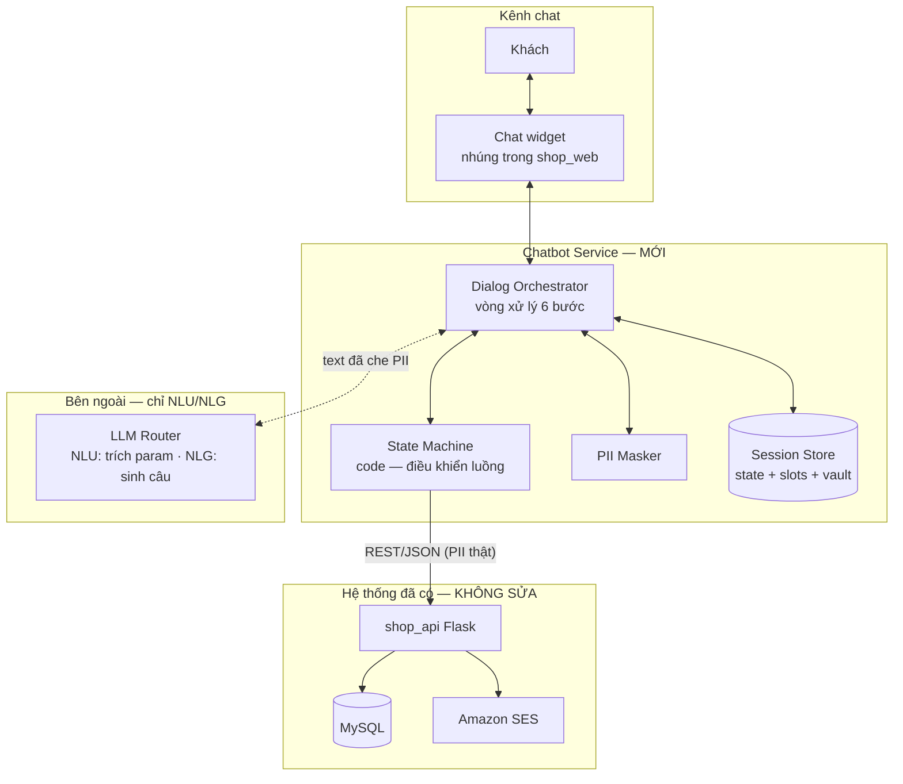
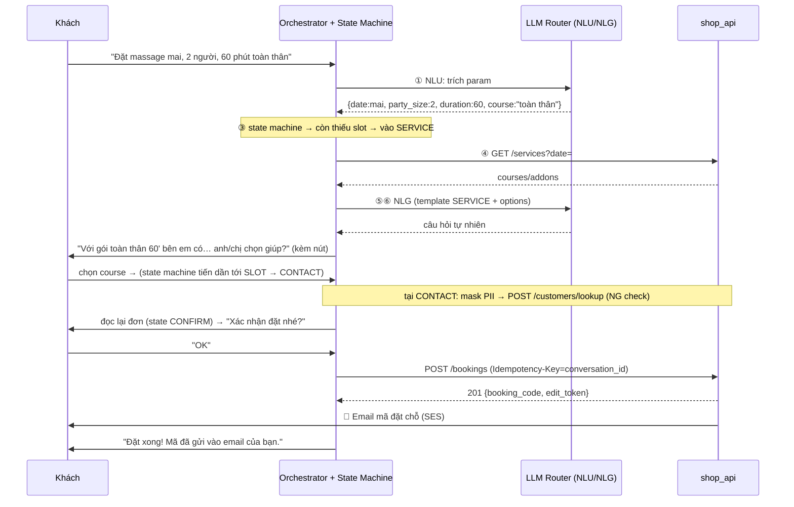

# Thiết kế kiến trúc — AI Chatbot đặt lịch (text)
## Hệ thống booking massage りらくる — Giai đoạn 2

| | |
|---|---|
| **Phạm vi** | Chatbot **text** trên web. Chưa làm kênh gọi điện (voice). |
| **Nguyên tắc nền** | Chatbot là **client** của `shop_api`, giống FE web — không chứa business logic riêng, mọi business rule do BE enforce. |
| **Mô hình điều khiển** | **State machine (code backend) là bộ điều khiển.** LLM chỉ đóng vai **NLU** (hiểu input) + **NLG** (sinh câu trả lời từ template). LLM KHÔNG lái luồng, KHÔNG tự quyết gọi API. |
| **Tài liệu liên quan** | `business-analysis-draft.md` (BR-01→BR-20) · `api-design.md` (catalog lỗi) · `openapi.yaml` · `erd-schema.sql` |

---

## 0. Tóm tắt cho người đọc nhanh

- Thêm **1 service mới** (chatbot), **không sửa** hệ thống giai đoạn 1 — trừ một middleware API key + rate limit ở `shop_api`.
- **Luồng do state machine (code) điều khiển theo đúng 12 bước của UC-01.** LLM chỉ dùng ở hai đầu: đọc hiểu tin nhắn khách (NLU → trích param) và viết câu trả lời (NLG từ template). Việc "state nào tiếp theo", "gọi API nào", "validate gì" đều là logic backend xác định (deterministic), không giao cho LLM.
- LLM gọi qua **router bên ngoài** ⇒ áp dụng **PII masking**: SĐT, email, mã đặt chỗ **không bao giờ rời hệ thống** (mục 6).
- Hỗ trợ **3 ngôn ngữ** (Nhật/Anh/Việt).
- Bot bí → **2 lối thoát**: số điện thoại cửa hàng, hoặc chat với nhân viên trực tuyến.

### Các quyết định đã chốt

| # | Quyết định |
|---|---|
| 1 | Chat UI: **widget nhúng trong web của mình** (chưa dùng LINE/Zalo/Messenger) |
| 2 | LLM: gọi qua **router OpenAI-compatible** → bắt buộc có PII masking |
| 3 | Hỗ trợ **3 ngôn ngữ**: Nhật, Anh, Việt — tự nhận diện theo tin nhắn khách |
| 4 | **Bot không được dùng thông tin cá nhân** của khách ngoài đơn đặt trong phiên hiện tại |
| 5 | Bot bí → **2 lựa chọn**: gọi cửa hàng, hoặc chat nhân viên trực tuyến (khi có người online) |
| 6 | **LLM = NLU + NLG, không phải orchestrator.** State machine backend điều khiển luồng. |

---

## 1. Mô hình điều khiển — điểm cốt lõi

> Phân biệt hai kiến trúc thường bị lẫn:

**❌ Cách 1 — LLM orchestrator (KHÔNG chọn):** đưa hết tool cho LLM, LLM tự quyết hỏi gì / gọi API nào / khi nào tạo booking. Khó kiểm soát, khó test, LLM dễ bỏ bước hoặc gọi sai thứ tự, và mỗi lần chạy có thể khác nhau.

**✅ Cách 2 — State machine điều khiển, LLM ở hai đầu (CHỌN):**

```
              ┌─────────────── vòng xử lý 1 lượt chat ───────────────┐
              │                                                       │
 User text ──▶│  ① NLU (LLM)      trích param từ câu nói             │
              │      ↓             {date, time, party_size, ...}      │
              │  ② MERGE          gộp param vào session state         │
              │      ↓                                                │
              │  ③ STATE MACHINE  (code) — dựa trên param ĐÃ CÓ,      │
              │      ↓             quyết định state tiếp theo         │
              │  ④ VALIDATE +     (code) — kiểm tra + gọi shop_api    │
              │     CALL API       nếu state cần dữ liệu              │
              │      ↓                                                │
              │  ⑤ BUILD PROMPT   (code) — ghép template instruction  │
              │      ↓             của state + param → prompt         │
              │  ⑥ NLG (LLM)      sinh câu trả lời tự nhiên          │
              │      ↓                                                │
 Bot text ◀───│  trả về khách                                        │
              └───────────────────────────────────────────────────────┘
```

- **LLM chỉ xuất hiện ở ① và ⑥** — hiểu input, viết output. Không thấy toàn bộ luồng, không tự quyết định nghiệp vụ.
- **Bước ③④⑤ là code thuần** — deterministic, test được bằng unit test, không phụ thuộc LLM.
- Ví dụ mentor đưa: *"Tôi muốn đặt lịch lúc 8 giờ hôm nay"* → ① NLU extract `{date: today, time: 08:00}` → ② merge → ③ state machine thấy đã có date+time nhưng **thiếu duration** → route sang state `DURATION` → ④ (state này không cần API) → ⑤ build prompt từ template "hỏi thời lượng" → ⑥ LLM sinh: *"Bạn muốn massage trong bao lâu ạ? Cửa hàng có các gói 30/45/60/90/120 phút."*

---

## 2. Kiến trúc tổng quan



> **Chú ý vai trò:** đường gọi `shop_api` xuất phát từ **State Machine (code)**, không phải từ LLM. LLM chỉ nối với Orchestrator để nhận việc NLU/NLG.

**Thành phần:**

| Thành phần | Vai trò |
|---|---|
| **Chat widget** | Ô chat nhúng trong web (React) |
| **Dialog Orchestrator** | Chạy vòng 6 bước mục 1 cho mỗi lượt chat |
| **State Machine** | Code deterministic: giữ định nghĩa state, quyết định chuyển state, gọi `shop_api`, validate |
| **PII Masker + Vault** | Che SĐT/email trước khi gửi LLM; giữ giá trị thật (mục 6) |
| **Session Store** | Redis — mỗi `conversation_id`: state hiện tại, slots đã thu, vault, lịch sử |
| **LLM Router** | Bên ngoài — chỉ làm NLU (trích param) và NLG (sinh câu từ prompt) |

---

## 3. State Machine — định nghĩa chi tiet

### 3.1 Danh sách state (bám UC-01)

Mỗi state khai báo 4 thứ: **slot cần có để rời state**, **điều kiện vào**, **API gọi khi vào**, **template prompt cho NLG**.

| State | Slot phải có để qua state sau | Điều kiện vào | API gọi (bước ④) | Prompt NLG (bước ⑤) |
|---|---|---|---|---|
| `GREETING` | — | bắt đầu phiên | — | chào + hỏi nhu cầu |
| `SHOP` | `shop_id` | — | `GET /shops` (lấy danh sách để render nút) | hỏi chọn cửa hàng |
| `DATE` | `date` | có `shop_id` | — | hỏi ngày |
| `PARTY_SIZE` | `party_size` (1–3) | có `date` | — | hỏi số người; >3 → nhánh handoff (BR-14) |
| `DURATION` | `duration` | có `party_size` | — | hỏi thời lượng |
| `SERVICE` | `course_id` (+ `addons`) | có `duration` | `GET /services?date=` | hỏi course; disable add-on cấm (BR-09) |
| `SLOT` | `slot` | đủ shop/date/service/party | `GET /slots?...` | đọc 3–5 giờ trống gần mong muốn |
| `THERAPIST` | `therapist` hoặc "bỏ qua" | **chỉ khi `party_size==1`** (BR-04) | `GET /therapists?date=` | hỏi có chỉ định không |
| `CONTACT` | `phone`, `email` | có `slot` | `POST /customers/lookup` (chặn NG — BR-06) | hỏi SĐT + email |
| `CONFIRM` | khách xác nhận "đồng ý" | đủ mọi slot | — | đọc lại toàn bộ đơn, xin xác nhận |
| `CREATE` | (kết quả) | đã confirm | `POST /bookings` | báo thành công + mã, hoặc xử lý lỗi |
| `DONE` | — | tạo xong | — | kết thúc / mời sửa nhanh (BR-17) |

### 3.2 Logic chuyển state (bước ③ — code, không phải LLM)

Quy tắc chọn state tiếp theo, chạy sau mỗi lần merge param:

```
next_state = state đầu tiên (theo thứ tự bảng 3.1) mà slot yêu cầu CHƯA đủ,
             bỏ qua state có điều kiện vào không thỏa (vd: THERAPIST khi party_size>1).
```

Nhờ vậy:
- Khách nói gộp *"mai 2 người 60 phút"* → merge lấp `date, party_size, duration` một lượt → state machine nhảy thẳng tới `SERVICE`, không hỏi lại 3 câu.
- Khách sửa giữa chừng *"à cho 3 người"* → cập nhật `party_size`, các slot sau vẫn giữ; nếu `party_size` đổi từ 1→3 thì slot `therapist` bị **xóa** (không còn hợp lệ — BR-04) và state quay lại nhánh phù hợp.

### 3.3 Ví dụ một lượt (đúng mô hình mentor)

```
User: "Tôi muốn đặt lịch lúc 8 giờ hôm nay"
① NLU (LLM)      → extract {date: 2026-07-23, time: "08:00"}
② MERGE          → session.slots += {date, slot_time_mong_muon: 08:00}
③ STATE MACHINE  → có date; thiếu party_size → next_state = PARTY_SIZE
④ VALIDATE/API   → PARTY_SIZE không cần API; kiểm tra date hợp lệ (không phải quá khứ)
⑤ BUILD PROMPT   → template[PARTY_SIZE] + {lang: vi} 
                   = "Hỏi khách đặt cho mấy người. Nhắc tối đa 3 người/lượt."
⑥ NLG (LLM)      → "Dạ, anh/chị đặt cho mấy người ạ? (tối đa 3 người mỗi lượt)"
```

Ghi chú: `time: 08:00` được giữ làm "giờ mong muốn" để khi tới state `SLOT` ưu tiên gợi ý quanh 8:00 — nhưng slot thật vẫn phải qua `GET /slots`, không tin giờ khách nói là chắc chắn còn trống.

### 3.4 NLU trích param — hợp đồng đầu ra

Bước ① gọi LLM với instruction "chỉ trích xuất, không trả lời", nhận về JSON cố định (không cho LLM tự do văn xuôi):

```json
{
  "intent": "book | modify | cancel | ask_info | chitchat | handoff",
  "entities": {
    "date": "2026-07-23 | null",
    "time": "08:00 | null",
    "party_size": "1 | null",
    "duration": "60 | null",
    "course": "text | null",
    "addons": [],
    "therapist": "name|gender|none|null",
    "confirm": "yes|no|null"
  }
}
```

Code validate JSON này trước khi merge (sai schema → coi như không trích được, hỏi lại). Đây là ranh giới rõ giữa "LLM hiểu" và "code quyết định".

---

## 4. Tools — API giai đoạn 1 do State Machine gọi (không phải LLM tự gọi)

| Bước gọi | API | Ghi chú |
|---|---|---|
| vào `SHOP` | `GET /shops` | render nút chọn |
| vào `SERVICE` | `GET /shops/{id}/services?date=` | `restricted_course_ids` để chặn combo cấm sớm (BR-09) |
| vào `SLOT` | `GET /shops/{id}/slots?...` | trả giờ trống thật |
| vào `THERAPIST` | `GET /shops/{id}/therapists?date=` | chỉ khi `party_size==1` (BR-04) |
| vào `CONTACT` | `POST /customers/lookup` | phát hiện NG list (BR-06) |
| `CREATE` | `POST /bookings` | `Idempotency-Key = conversation_id` |
| (sửa trong phiên) | `PATCH /bookings/{code}` | dùng `edit_token` còn hạn 2 phút (BR-17) |
| (hủy) | `POST /bookings/{code}/cancel` | |

Mọi validate nghiệp vụ vẫn do BE làm — chatbot chỉ hỏi/hiển thị, BE là chốt chặn cuối.

### 4.1 Error code → câu trả lời (bước ⑤⑥ khi API trả lỗi)

BE trả `error.code` → state machine chọn nhánh xử lý + template tương ứng, LLM diễn đạt theo ngôn ngữ đang dùng:

| error.code | Nhánh xử lý | Ý câu bot |
|---|---|---|
| `SLOT_CONFLICT` | quay lại `SLOT`, đọc `suggested_slots` | "Giờ đó vừa hết, còn 14:15/14:30/15:00…" (A6) |
| `PHONE_BLOCKED` | sang `END` | "SĐT này không đặt online được, liên hệ cửa hàng…" (A5) |
| `THERAPIST_OFF_SHIFT` | quay lại `THERAPIST`/`SLOT` | "Nhân viên đó không có ca, đổi giờ hay bỏ chỉ định?" (A4) |
| `INVALID_COMBO` | quay lại `SERVICE` | "Add-on đó không kèm được course này…" (A3) |
| `PARTY_SIZE_EXCEEDED` | nhánh handoff | ">3 người vui lòng liên hệ cửa hàng" (A8/BR-14) |
| `MODIFY_DEADLINE_PASSED` | thông báo | "Sát giờ hẹn, không đổi online được…" (BR-16) |
| `INTERNAL_ERROR` | giữ state, mời thử lại | "Hệ thống trục trặc, thử lại sau…" (A7/BR-12) |

### 4.2 Guardrails

1. **Xác nhận trước khi ghi** — `POST /bookings` chỉ chạy khi state = `CONFIRM` và khách đã đồng ý
2. **State machine kiểm soát, không để LLM nhảy bước** — LLM không có quyền gọi API; kể cả NLU trả param lạ, code vẫn chỉ đi theo bảng chuyển state
3. **Bot không dùng dữ liệu cá nhân ngoài đơn hiện tại** *(quyết định 4)*
4. **BE validate lại toàn bộ** — chống prompt injection: dù LLM bị lừa, BE vẫn chặn (validate 2 tầng từ giai đoạn 1)

---

## 5. Sequence — một phiên đặt chỗ thành công



---

## 6. Bảo mật dữ liệu người dùng — PII Masking ⭐

> LLM gọi qua router bên ngoài ⇒ 2 bên thứ ba trong chuỗi. **PII không bao giờ rời hệ thống mình.**

### 6.1 Cơ chế

```
Khách gõ:  "SĐT mình 0901234567, email a@b.com"
   ① Regex bắt PII trước khi vào LLM → PII Vault (phía mình):
        {{phone_1}}="0901234567"  {{email_1}}="a@b.com"
   ② Gửi ra LLM chỉ text đã che:  "SĐT mình {{phone_1}}, email {{email_1}}"
   ③ NLU trả param dạng placeholder:  {phone:"{{phone_1}}", email:"{{email_1}}"}
   ④ State machine thay giá trị thật KHI gọi nội bộ:
        → shop_api: POST /bookings {"phone":"0901234567", ...}
   ⑤ Response che lại trước khi vào context LLM:
        LLM thấy "khách Gold, 12 lần ghé" — không tên/SĐT
```

Kết quả: nhà cung cấp LLM chỉ thấy *ý định*, không nhận PII nào.

### 6.2 PII phải mask

| Loại | Cách bắt | Placeholder |
|---|---|---|
| Số điện thoại | regex (VN + JP) | `{{phone_N}}` |
| Email | regex | `{{email_N}}` |
| Mã đặt chỗ | regex `\d{8}-\w+-\w+` | `{{code_N}}` |
| Tên khách | từ response API — không đưa vào context | — |

### 6.3 Lớp phòng vệ bổ sung

1. **Cấu hình router**: bật lọc provider *zero-retention / không train*; lưu ảnh chụp setting, kiểm tra định kỳ
2. **LLM adapter** `llm_client.py`: đổi provider chỉ sửa `base_url`+`api_key` (dễ chuyển Bedrock Tokyo / self-host)
3. **Log cũng mask**, TTL 30–90 ngày; session store mã hóa at-rest
4. **Minh bạch**: câu chào nói rõ đang chat với AI (yêu cầu APPI)

### 6.4 So sánh phương án LLM

| Phương án | An toàn | Đánh đổi |
|---|---|---|
| Self-host | Cao nhất | Tốn GPU, tiếng Nhật kém hơn |
| Bedrock/Azure Tokyo | Cao — data trong Nhật, có DPA | Chi phí/setup cao |
| API vendor + zero-retention | Khá | Data ra khỏi Nhật |
| **Router** *(đang dùng)* | Thấp nhất | Rẻ, đổi model dễ, hợp dev |

**Kết luận:** với masking đầy đủ, rủi ro 4 phương án gần như tương đương. Router hợp cho dev; production cần khách chấp thuận (mục 10).

---

## 7. Thiết kế hội thoại

- **Đa ngôn ngữ (Nhật/Anh/Việt)**: NLU nhận diện lang từ tin nhắn đầu → lưu vào session → mọi prompt NLG truyền `lang`. Dữ liệu nghiệp vụ (tên course tiếng Nhật) giữ nguyên, gọi API bằng `id`. Format ¥/giờ theo locale.
- **Human handoff** *(quyết định 5)*: bot bí → 2 nút `[📞 Gọi cửa hàng]` `[💬 Chat nhân viên]` (nút 2 chỉ hiện khi có người online). Handoff → state `HUMAN`, bot ngừng tự trả lời, nhân viên thấy lịch sử (đã mask PII). Cần thêm màn "Hộp thư hỗ trợ" cho nhân viên (mục 10).
- **Lựa chọn dạng nút** cho shop/số người/slot/course — giảm gõ, giảm NLU sai.

---

## 8. Hạ tầng & vận hành

- **Service tách riêng** khỏi `shop_api` (repo mới)
- **Auth kênh chatbot**: `shop_api` cấp API key + rate limit — thay đổi duy nhất phía BE
- **Tracing**: `conversation_id` gắn vào mọi request; log transcript (đã mask) + state transitions + tool calls
- **Metrics**: tỉ lệ đặt thành công · số lượt hỏi lại · tỉ lệ handoff · chi phí LLM/phiên

---

## 9. Lộ trình build MVP

| # | Việc | Ghi chú |
|---|---|---|
| 1 | Chat widget + backend nhận message | |
| 2 | **PII Masker** | làm sớm; unit test regex |
| 3 | `llm_client.py` adapter | NLU + NLG qua router |
| 4 | **State machine + định nghĩa state (mục 3)** | phần lõi — code deterministic, test không cần LLM |
| 5 | NLU extractor (JSON schema mục 3.4) | |
| 6 | Nối API đọc: shops → services → slots | |
| 7 | `CONFIRM` + `create_booking` + map error code | |
| 8 | Session store; sửa/hủy trong phiên | |
| 9 | Human handoff + màn hộp thư nhân viên | |
| 10 | Test kịch bản | thành công · NG · conflict · combo cấm · nhóm >3 · nói gộp nhiều param · sửa giữa chừng · đổi ngôn ngữ · handoff |

> Mẹo test: vì bước ③④⑤ là code, viết **unit test cho state machine** không cần gọi LLM thật — cho param giả, assert state tiếp theo + API được gọi. LLM chỉ mock ở ① và ⑥.

---

## 10. Rủi ro chính

| Rủi ro | Giảm thiểu |
|---|---|
| LLM bịa thông tin (giá, dịch vụ không có) | Mọi số liệu lấy từ API; NLG chỉ diễn đạt param truyền vào, cấm tự sinh |
| NLU trích sai param | Validate JSON schema; sai → hỏi lại; dùng nút bấm cho lựa chọn quan trọng |
| Prompt injection | BE validate lại; LLM không có quyền gọi API (chỉ code gọi) |
| Rò rỉ PII qua router | Masking (mục 6) |
| Chi phí LLM | Giới hạn token/phiên, cache tool đọc, đo chi phí/phiên |
| Chất lượng tiếng Nhật | Thử nhiều model qua router ở dev rồi chốt |

---

## 11. Cần chốt với mentor

1. **Production** có tiếp tục dùng router bên ngoài không, hay khách yêu cầu provider/region cụ thể?
2. **Nhân viên trực chat là ai** — cửa hàng hay bộ phận riêng? Giờ trực? Ngoài giờ chỉ còn phương án gọi điện.
3. **Màn "Hộp thư hỗ trợ"** cho nhân viên: làm ở giai đoạn nào — cần bổ sung wireframe.
4. **NLU**: tự viết prompt trích param, hay dùng thư viện/framework (vd LangGraph, hay function-calling của LLM chỉ để trích entity)? — ảnh hưởng cách code state machine.