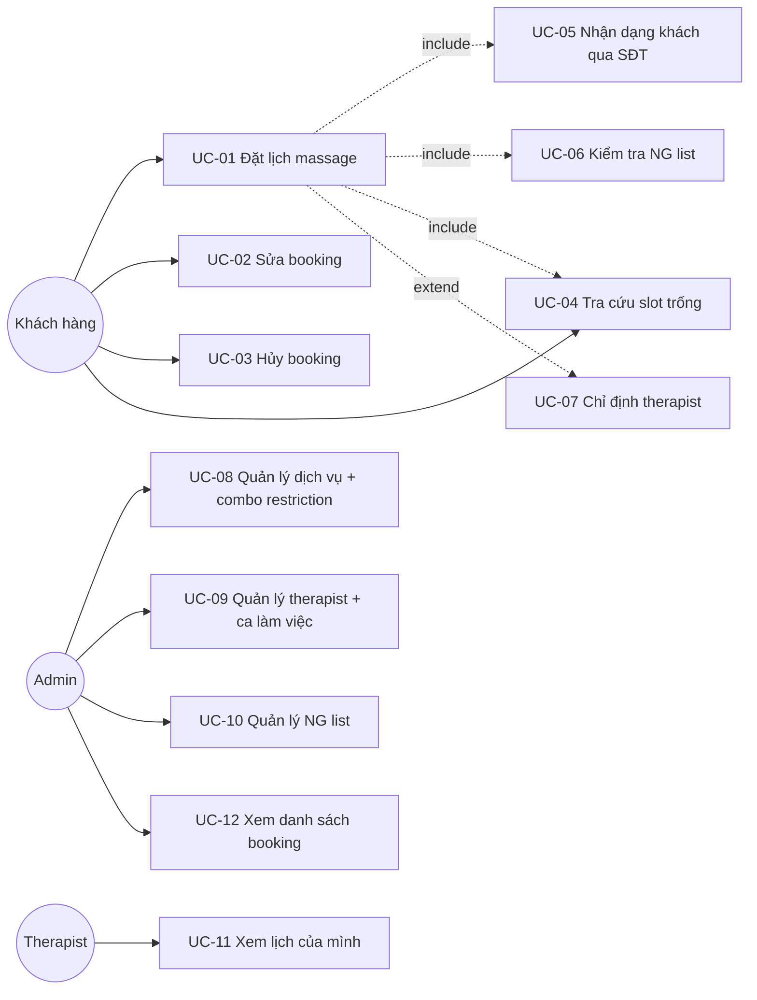
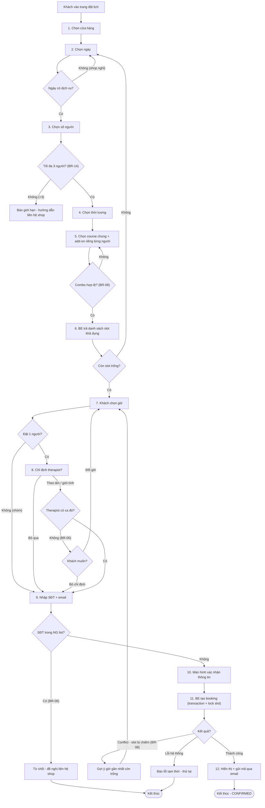
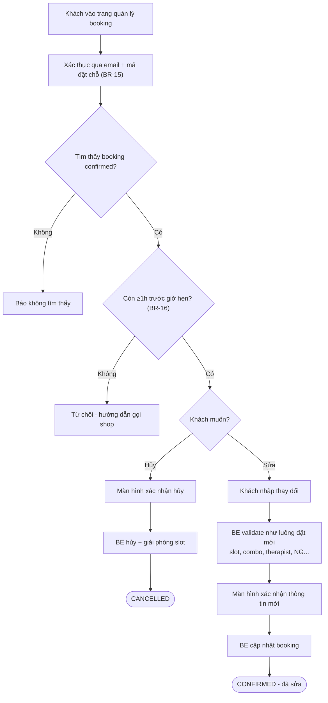

# Draft — Use Case / User Stories / Process Flow
## Hệ thống booking massage りらくる (BE + FE)

> **Scope (chốt với mentor 09/07):** Team tự build toàn bộ hệ thống booking = **BE cung cấp API + FE web**. Không có POS bên ngoài. AI chatbot là client tương lai của bộ API, **ngoài scope giai đoạn 1**. Các điểm chưa rõ đánh dấu ❓.

---

## 1. Actors (Tác nhân)

| Actor | Mô tả |
|---|---|
| **Khách hàng** | Đặt/sửa/hủy lịch qua FE web |
| **Quản lý / Admin** | Có trang admin (đã chốt): quản lý dịch vụ, combo restriction, therapist, ca làm việc, NG list |
| **Therapist** | Có trang riêng xem lịch làm việc và booking được gán cho mình (đã chốt) |
| *(AI chatbot — tương lai)* | Client gọi cùng bộ API như FE; không phải actor giai đoạn này, nhưng API phải thiết kế đủ tổng quát |

---

## 2. Use Cases

### Sơ đồ tổng quan

### Đặc tả use case chính: UC-01 Đặt lịch massage

| Mục | Nội dung |
|---|---|
| **Actor** | Khách hàng (qua FE web) |
| **Mô tả** | Khách tự thao tác trên web theo từng bước, BE validate và tạo booking |
| **Precondition** | Khách truy cập trang đặt chỗ |
| **Postcondition** | Booking được lưu trong hệ thống, khách nhận mã đặt chỗ |
| **Trigger** | Khách bấm "Đặt lịch" |

**Main flow (luồng chính):**

1. Khách chọn cửa hàng
2. Khách chọn ngày
3. Khách chọn số người (1 hoặc nhóm 2–3 người — BR-14)
4. Khách chọn thời lượng (bội số 15 phút)
5. Khách chọn course chính (cả nhóm dùng chung — BR-10), mỗi người tùy chọn add-on riêng
6. BE trả danh sách slot khả dụng theo các điều kiện trên (BR-07)
7. Khách chọn giờ bắt đầu
8. (Chỉ booking 1 người) FE hiện tùy chọn chỉ định therapist theo tên/giới tính (BR-04)
9. Khách nhập SĐT + email → BE tra hạng thành viên + kiểm tra NG list (email dùng xác thực & nhận mã — BR-15)
10. FE hiển thị màn hình xác nhận toàn bộ thông tin
11. Khách xác nhận → BE validate lại + tạo booking trong transaction (lock slot) → sinh mã đặt chỗ (BR-12)
12. FE hiển thị mã đặt chỗ + gửi mã qua email (BR-15)

**Alternative / Exception flows:**

| Mã | Tại bước | Tình huống | Xử lý |
|---|---|---|---|
| A1 | 6 | Ngày không có dịch vụ (shop nghỉ/thiếu người) | Báo khách, quay lại chọn ngày |
| A2 | 6 | Ngày hết slot | Báo khách, quay lại chọn ngày |
| A3 | 5 | Combo course+add-on bị cấm (BR-09, bảng combo_restriction) | FE chặn/báo ngay, yêu cầu chọn lại |
| A4 | 8 | Therapist không làm ca đó (BR-05) | Khách chọn: đổi giờ hoặc bỏ chỉ định |
| A5 | 9 | SĐT trong NG list (BR-06) | Từ chối tạo booking, đề nghị liên hệ cửa hàng trực tiếp → kết thúc |
| A6 | 11 | Slot vừa bị người khác đặt mất — conflict (BR-08) | BE trả lỗi conflict, FE gợi ý giờ gần nhất còn trống → quay lại bước 7 |
| A7 | 11 | Lỗi hệ thống | Báo lỗi tạm thời, khách thử lại → kết thúc |
| A8 | 3 | Khách muốn đặt nhóm >3 người (BR-14) | Báo giới hạn 3 người/booking, hướng dẫn liên hệ cửa hàng (đã chốt) |

**Business rules liên quan:** BR-01, BR-02, BR-04, BR-05, BR-06, BR-08, BR-09, BR-10, BR-12, BR-14

### Đặc tả tóm tắt các use case còn lại

| UC | Precondition | Luồng chính | Ghi chú |
|---|---|---|---|
| UC-02 Sửa booking | Booking confirmed; xác thực qua email + mã đặt chỗ (BR-15); còn ≥1 giờ trước giờ hẹn (BR-16) | Tra booking → khách sửa → BE validate như đặt mới → cập nhật | Đổi được: giờ, dịch vụ, số người ≤3; >3 hoặc đổi cửa hàng → liên hệ shop (BR-18). Sửa nhanh bằng session token trong 2 phút sau khi tạo (BR-17) |
| UC-03 Hủy booking | Như UC-02 (deadline ≥1 giờ — BR-16) | Tra booking → xác nhận hủy → BE chuyển trạng thái CANCELLED, giải phóng slot | |
| UC-04 Tra cứu slot | Đã có shop + ngày + dịch vụ + số người | BE tính slot khả dụng theo điều kiện | API này sau dùng chung cho AI chatbot |
| UC-05 Nhận dạng khách | Khách nhập SĐT | Tra SĐT → trả member/guest, rank, visit_count | include trong UC-01/02/03 |
| UC-06 Kiểm tra NG list | Có SĐT | SĐT trong ng_list → chặn | include trong UC-01 |
| UC-07 Chỉ định therapist | Booking 1 người | Chọn theo tên/giới tính → BE kiểm tra ca làm (shift) | extend của UC-01 |
| UC-08→12 Admin/Therapist | Đăng nhập nội bộ | CRUD dịch vụ, combo, therapist, ca, NG list; xem booking | Đã chốt: trong scope giai đoạn 1 |

---

## 3. User Stories

Định dạng: *Là [vai trò], tôi muốn [làm gì] để [đạt được gì]* + Acceptance Criteria (AC).

### Khách hàng

**US-01** — Là khách hàng, tôi muốn đặt lịch massage online trên web, để đặt được chỗ nhanh chóng bất cứ lúc nào mà không phải gọi điện.
- AC1: Hoàn thành đặt chỗ hoàn toàn trên web, không cần bước nào ngoài hệ thống
- AC2: Nhận mã đặt chỗ ngay khi đặt thành công
- AC3: Nếu slot mong muốn hết, được gợi ý giờ gần nhất còn trống

**US-02** — Là khách hàng đi một mình, tôi muốn chỉ định therapist theo tên hoặc giới tính, để được người mình tin tưởng phục vụ.
- AC1: Chỉ định được theo tên cụ thể hoặc chỉ theo giới tính
- AC2: Nếu therapist không làm ca đó, được chọn: đổi giờ hoặc bỏ chỉ định
- AC3: Booking từ 2 người trở lên không hiện tùy chọn chỉ định (BR-04)

**US-03** — Là khách hàng đi theo nhóm, tôi muốn đặt cho cả nhóm trong một lần, để mọi người được phục vụ cùng giờ.
- AC1: Một lần đặt tạo được booking cho 2–3 người, cùng giờ bắt đầu
- AC2: Cả nhóm dùng cùng một course chính; add-on mỗi người chọn riêng (BR-10)
- AC3: Chỉ hiển thị các slot đủ chỗ cho cả nhóm
- AC4: Yêu cầu >3 người bị từ chối kèm hướng dẫn (BR-14)

**US-04** — Là khách hàng đã đặt chỗ, tôi muốn tự sửa hoặc hủy booking online, để linh hoạt khi kế hoạch thay đổi.
- AC1: Xác thực qua email + mã đặt chỗ đã gửi trong mail (BR-15)
- AC2: Thay đổi được hiển thị xác nhận trước khi thực hiện
- AC3: Nhận xác nhận sau khi sửa/hủy thành công; hủy thì slot được giải phóng
- AC4: Sửa/hủy bị từ chối nếu còn <1 giờ trước giờ hẹn (BR-16)
- AC5: Trong 2 phút sau khi tạo, sửa nhanh được bằng session token BE cấp; hết hạn thì sửa/hủy qua trang quản lý web hoặc gọi cửa hàng (BR-17)
- AC6: Sửa được: ngày/giờ, dịch vụ, số người (≤3); muốn đổi lên >3 người hoặc đổi cửa hàng → hướng dẫn liên hệ cửa hàng (BR-18)

**US-05** — Là khách hàng thành viên, tôi muốn hệ thống nhận ra tôi qua SĐT, để không phải khai báo lại thông tin mỗi lần đặt.
- AC1: Nhập SĐT là hệ thống biết hạng thành viên, số lần ghé thăm
- AC2: Khách mới vẫn đặt được bình thường (chỉ cần SĐT)

### Admin / Cửa hàng (đã chốt: trong scope)

**US-06** — Là quản lý cửa hàng, tôi muốn bật/tắt dịch vụ theo ngày, để khách không đặt được dịch vụ mà hôm đó không phục vụ.
- AC1: Dịch vụ bị tắt không xuất hiện trong luồng đặt chỗ của ngày đó

**US-07** — Là quản lý cửa hàng, tôi muốn quản lý NG list, để chặn khách có lịch sử xấu.
- AC1: Thêm/xóa SĐT khỏi NG list; SĐT trong list bị từ chối tạo booking (BR-06)

**US-08** — Là therapist, tôi muốn có trang riêng xem lịch ca và các booking được gán cho mình, để chuẩn bị cho ca làm việc. (Đã chốt: trong scope.)
- AC1: Therapist xem được ca làm việc và danh sách booking gán cho mình theo ngày

### Tương lai (ngoài scope — để định hướng thiết kế API)

**US-09** — Là AI chatbot (giai đoạn 2), tôi muốn bộ API phủ đủ mọi bước của luồng đặt chỗ (tra slot, tra khách, tạo/sửa/hủy booking), để thay khách thao tác qua hội thoại điện thoại.
- Hệ quả thiết kế: logic nghiệp vụ đặt 100% ở BE, FE chỉ là một client — không nhét rule vào FE

---

## 4. Process Flow

### Luồng chính: Đặt lịch (kèm mọi nhánh ngoại lệ)

### Luồng phụ: Sửa / Hủy booking

---

## ❓ Câu hỏi cần clarify với mentor

1. ~~Xác thực sửa/hủy?~~ → **Đã chốt: qua email + mã đặt chỗ gửi qua email; vẫn thu SĐT (BR-15).**
2. ~~Scope trang therapist / admin?~~ → **Đã chốt: có cả hai (UC-08→12).**
3. ~~Deadline sửa/hủy? Sửa trường nào?~~ → **Đã chốt: cả hai ≥1 giờ trước giờ hẹn (BR-16); sửa được giờ/dịch vụ/số người ≤3, >3 → liên hệ shop (BR-18).** Còn lại: có đổi được cửa hàng không?
4. ~~Nhóm >3?~~ → **Đã chốt: hướng dẫn liên hệ cửa hàng (BR-14).**
5. ~~Thông báo mã?~~ → **Đã chốt: gửi qua email (BR-15).**
6. Combo bị cấm: **chưa có data — mentor cung cấp sau.** Bảng combo_restriction để sẵn; tạm thời hệ thống coi mọi combo hợp lệ, có data thì seed vào.
7. ~~Session hết hạn khi nào?~~ → **Đã chốt: BE cấp session token lúc tạo booking, hiệu lực 2 phút; hết hạn → trang quản lý web (BR-17).**
